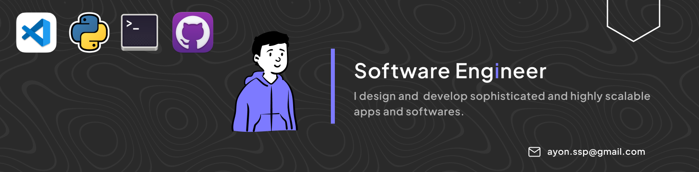

<h2> Hi, I'm <a href='https://bento.me/ayon-ssp' target="_blank">Ayon</a>! </h2>
<!-- <h2> Hi, I'm <a href='https://bento.me/ayon-ssp' target="_blank">Ayon</a>! </h2> -->

<!--  -->

<!--  -->
<!--  -->
<!--  -->
<!--  -->
<!--  -->


<!-- [](https://twitter.com/AyonSsp)
[](https://www.linkedin.com/in/ayon-ssp/)
[](https://github.com/Thaiane) -->


###   About Me

```javascript
const Ayon_ssp = {
  pronouns: "he" | "him",
  Iam : ["Software Developer", "OPEN SOURCE Dev", "Competitive Programming"],
  code: [Python, SQL, Javascript, CSS, PHP, C/C++],
  tools & Tech: [Django, Django-REST, React JS, vscode, Node, PostgreSQL, Docker, Linux, Git, Flask, HTML, Postman],
  TechWork: {
          Competitive Programming: "Solving Problems",
          OPEN SOURCE Dev : "RandomCoderOrg",
    },
  Experience: {
          Technical Content Writer: "GeeksForGeeks",
          Software_Developer Intern: "ENITIATE(Product Based Startup)",
          Software_Developer (Intern + Fulltime): "Mastek"
    },
 challenge: "Currently I'm focused on Django, Django REST api, React and DSA"
}
```

<!--  {4★ on CodeChef} {1564 rating on LeetCode} -->

### Bye, Nice to Meet You !!

<div style="text-align: center;">

</div>

```
████████████████████████████████████████████████████████████  ███████╗██╗   ██╗███████╗
████████████████████████████████████████████████████████████  ██╔══██║╚██╗ ██╔╝██╔════╝
███████████████████████████████████`.        ╙██████████████  ███████║ ╚████╔╝ █████╗  
████████████████████████████████▀  ¿▓▓▓▓▓▓▓▓▄/ "████████████  ██╔══██║  ╚██╔╝  ██╔══╝  
██████████████████████████████▀.  ▓▓▓▓▓▓▓▓▓▓▓▓   ▐██████████  ███████║   ██║   ███████╗▄█╗
██████████████████████████████ `  ▓▓▓▓▓▓▓▓▓▓▓▓  ` ██████████  ╚══════╝   ╚═╝   ╚══════╝╚═╝
██████████████████████████████ `  ▓▓▓▓▓▓▓▓▓▓▓▓   ▄██████████
▀██████████████████████████████▌  ▀▀▓▓▓▓▓▓▓▌╓╖. ████████████  ███╗   ██╗██╗ ██████╗███████╗  ████████╗ ██████╗
█▄▀██████████████████████████████▄ ╩╦╙▀▀▀▀▀ ╣`,█████████████  ████╗  ██║██║██╔════╝██╔════╝  ╚══██╔══╝██╔═══██╗
▄▀█▄╙█████████████████████▀▀▀▀█████▄▄ .... ,▄███████▀███████  ██╔██╗ ██║██║██║     █████╗       ██║   ██║   ██║
██▄▀█▄╙█████████████████▀  ╪╢%╦══~╓,└ ╚▒▒▒ ╙▀|,╓╓═╤H   ▀████  ██║╚██╗██║██║██║     ██╔══╝       ██║   ██║   ██║
█▀▀▀-▀█▌▄▀█████████████   ║▒▒▒▒▒▒▒▒▒▒╢╦ ╘ -╣▒▒▒▒▒▒▒▒▒╢╕   ▀█  ██║ ╚████║██║╚██████╗███████╗     ██║   ╚██████╔╝
██▄▀██└║▄▄▄████████████▄          ═╕╕╕╕╕═╕═══════       ▄▄▄▄  ╚═╝  ╚═══╝╚═╝ ╚═════╝╚══════╝     ╚═╝    ╚═════╝
████▄▀█▌║███  ████████▌         ╕   ╩▒▒▒▒▒▒▒▒▒Ñ          ███
██████▌Ö▓▌   ▀██████████`╔▒▒╣ █ ▒▒m   ╚▒╢▒▒▒╩ -╣▒ ▌ ▒▒▒ ████  ███╗   ███╗███████╗███████╗████████╗  ██╗   ██╗ ██████╗ ██╗   ██╗
████ -"" ∞╙,▀.╙▀███████╜ ▒▒▒ ▄█ Ñ   -   S.  ═▒▒▒▒ █ ║▒▒╕└███  ████╗ ████║██╔════╝██╔════╝╚══██╔══╝  ╚██╗ ██╔╝██╔═══██╗██║   ██║
████████▄ -«   ∞▄.▀",╓═     ╒██   ═╣▒▒ `Ñ╛        █▌ ▒▒▒ ███  ██╔████╔██║█████╗  █████╗     ██║      ╚████╔╝ ██║   ██║██║   ██║
█████████▌ º     ╤╣▒╣╩^",▄▄███▀  ▒▒╣"     ''''''' ▀▀     `██  ██║╚██╔╝██║██╔══╝  ██╔══╝     ██║       ╚██╔╝  ██║   ██║██║   ██║
█████████  ▌       ▄▄████████─         ---------    L'▒▒▒ ██  ██║ ╚═╝ ██║███████╗███████╗   ██║        ██║   ╚██████╔╝╚██████╔╝
▀▀▀▀▀▀▀▀▀▀▀▀▀-     ▀▀▀▀▀▀▀▀▀▀       '╧╧╧╧╧╧╧╧╧`     ╚ ╧╧╧- ▀  ╚═╝     ╚═╝╚══════╝╚══════╝   ╚═╝        ╚═╝    ╚═════╝  ╚═════╝
```


<!--  -->
<!-- <em><b>I love connecting with different people</b> so if you want to say <b>hi, I'll be happy to meet you more!</b> :)</em> -->


---

<!-- continuv searching(https://github.com/Anmol-Baranwal/Cool-GIFs-For-GitHub#extra-value-added  ) -->
<!-- 


Robot Arm Boogies Hard: Getting Jiggy with it!
Programming
Programming
Wave
How programmers feel when code doesn't works
Chill Floating
Dinosaur Game
JavaScript is the Boss


 -->