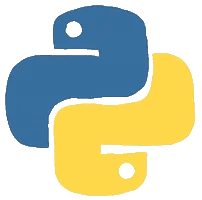
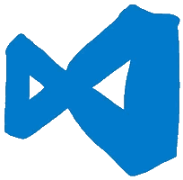
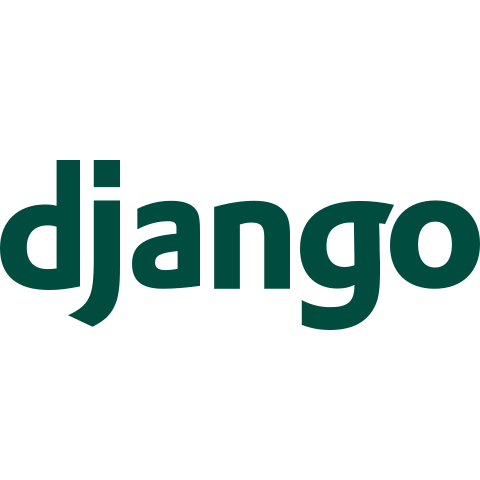

<h2> Hi, I'm <a href='https://bento.me/ayon-ssp' target="_blank">Ayon</a>! </h2>


<!--  -->






###   About Me

```javascript
const Ayon_ssp = {
  pronouns: "he" | "him",
  Iam : ["Software Developer", "OPEN SOURCE Dev", "Competitive Programming"],
  code: [Python, SQL, Javascript, CSS, PHP, C/C++],
  tools & Tech: [Django, Django-REST, React JS, vscode, Node, PostgreSQL, Docker, Linux, Git, Flask, HTML, Postman],
  TechWork: {
          Competitive Programming: "Solving Problems",
          OPEN SOURCE Dev : "RandomCoderOrg",
    },
  Experience: {
          Technical Content Writer: "GeeksForGeeks",
          Software_Developer Intern: "ENITIATE(Product Based Startup)",
          Back End Engineer: "DIGIFRILLS PVT LTD",
          SDE Intern: "Mastek",
    },
  WorkedOn: {
          Mastek: "Java, PL/SQL",
          DIGIFRILLS PVT LTD: "Node JS, MongoDB, API, Schema Design, Appwrite",
          ENITIATE: "React JS, JavaScript, JSON Web Token (JWT), PostgreSQL, Vite",
          RandomCoderOrgRandomCoderOrg: "Python (Programming Language), Api, yml, Linux, Github Actions",
          GeeksForGeeks: "Python, Postgres Database, SQL(PSQL), Linux, C++",
          College & Projects: "Python + DSA, Django, C (Programming language)",
    },


 challenge: "Currently I'm focused on Django, Django REST api, React and DSA"
}
```

<h3>Let's connect and learn together!</h3>
<hr>
